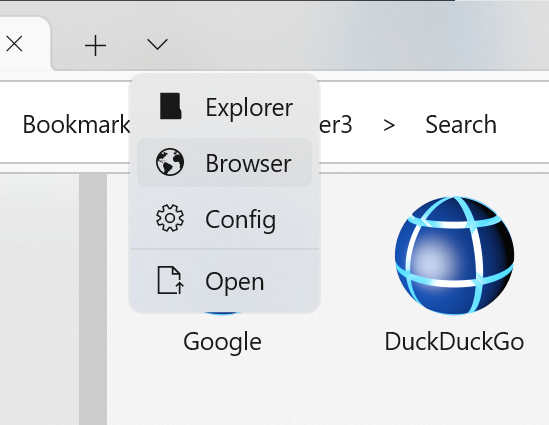
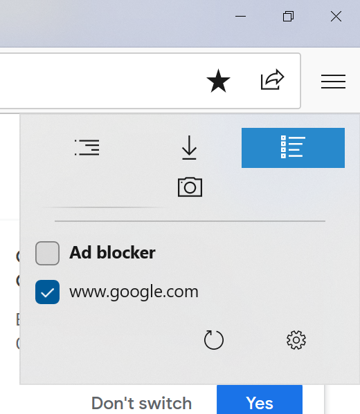
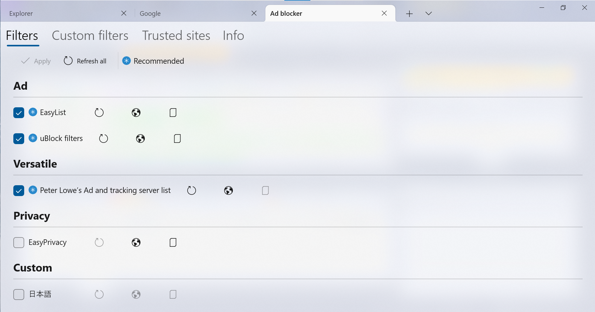

# AdBlocker
AdBlocker provides basic "ad blocker" function for BookViewer3 and some other apps.

## How to get started
1. Open the browser

Open the browser by clicking a random entry under "Bookmarks" or selecting the "Browser" in the pull-down menu (˅).

2. Enable AdBlocker and open manager

Click "≡" then select rightmost tab. Enable AdBlocker by selecting "Ad blocker". If filter is not downloaded, the manager is automatically launched. If not, just click setting button.

3. Download filters

Select the filters you want to add, then click ✓Apply.
"Recommended" is default selections of another ad-blocker.
Make sure you read documentation or license before selection.

## Method
AdBlocker of this app simply blocks request for URL in the filters.
Another AdBlocker use following methods but we do not.

* Injecting JavaScript.
* Block element in the page.

We use [DistillNET](https://github.com/TechnikEmpire/DistillNET) to analyze filter files.
[WebView.WebResource](https://learn.microsoft.com/uwp/api/windows.ui.xaml.controls.webview.webresourcerequested) Event and [CoreWebView2.WebResourceRequested](https://learn.microsoft.com/dotnet/api/microsoft.web.webview2.core.corewebview2.webresourcerequested?view=webview2-dotnet-1.0.1418.22) Event is used to intercept the request.

### YouTube
If WebView2 is enabled, video ads for YouTube is also blocked, sometimes.
For technical reasons, video ad blocking does not work when you open the play page currently.
It only works when you open another video on the play page.

In YouTube We rewrite the JSON file. In particular `playerAds` and `adPlacements` are removed.

If you don't want to enable this feature, just add "www.youtube.com" and other domains to whitelist.

This may no longer work if YouTube specs has been changed. Add issue or just disable in that case.

## Security
Filters are generally downloaded using SSL, but make sure your internet connection are secure.
Filters are downloaded periodically, not just when you download them in your Manager.

All we do is block requests (and YouTube stuffs), so we don't expect any major security breaches, but still.

## Licenses
Many existing ad blockers are GPLed and we use MIT, so we don't use their code.
We also let users download filters at their own discretion.
That said, we were careful not to confuse existing ad-block users.

## Performance
WebView version uses Wait() that prevent the thread. It can be a performance issue.

## Links
Our codes
* [Engine](https://github.com/kurema/BookViewerApp3/blob/master/BookViewerApp/Managers/ExtensionAdBlockerManager.cs)
* [Views](https://github.com/kurema/BookViewerApp3/tree/master/BookViewerApp/Views/BrowserAddOn)
* [Default filters](https://github.com/kurema/BookViewerApp3/blob/master/BookViewerApp/res/values/AdBlockList.xml)

References
* uBlock Origin
  * [chrome](https://chrome.google.com/webstore/detail/ublock-origin/cjpalhdlnbpafiamejdnhcphjbkeiagm) / [firefox](https://addons.mozilla.org/firefox/addon/ublock-origin/)
  * [GitHub](https://github.com/gorhill/uBlock)
  * [Wiki](https://github.com/gorhill/uBlock/wiki)
* [DistillNET](https://github.com/TechnikEmpire/DistillNET)
